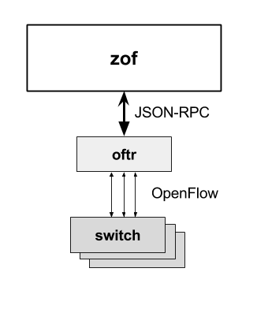

zof: OpenFlow Micro-Framework
=============================

|MIT licensed| |Build Status| |codecov.io|

*zof* is a Python framework for creating asyncio-based applications that control 
the network using the OpenFlow protocol.

Supported Features
------------------

- OpenFlow versions 1.0 - 1.4 (with partial support for 1.5)
- SSL connections
- Auxiliary OpenFlow connections over TCP and UDP
- Limited packet parsing and generation: ARP, LLDP, IPv4, IPv6, UDP, TCP, ICMPv4, ICMPv6
- App's can simulate switches; Supports both sides of the OpenFlow protocol

Requirements
------------

- Python 3.5.1 or later
- oftr command line tool

Install - Linux
---------------

.. code:: bash

    # Install /usr/bin/oftr dependency.
    sudo add-apt-repository ppa:byllyfish/oftr
    sudo apt-get update
    sudo apt-get install oftr

    # Create virtual environment and install latest zof.
    python3.5 -m venv myenv
    source myenv/bin/activate
    pip install git+https://github.com/byllyfish/zof.git

Demos
-----

To run the layer2 controller demo::

    python -m zof.demo.layer2

Architecture
------------

*zof* uses a separate *oftr* process to terminate OpenFlow connections and translate OpenFlow messages to JSON.

    
    Architecture: The oftr process translates OpenFlow to JSON.

You construct OpenFlow messages via YAML strings or Python dictionaries. Incoming OpenFlow messages are generic Python objects.  Special OpenFlow constants such as 'NO_BUFFER' appear as strings.

.. code:: yaml

    type: FLOW_MOD
    msg:
      command: ADD
      match:
        - field: IN_PORT
          value: 1
        - field: ETH_DST
          value: 00:00:00:00:00:01
      instructions:
        - instruction: APPLY_ACTIONS
          actions:
            - action: OUTPUT
              port_no: 2

The basic building block of zof is an *app*. An *app* is associated with various message and event handlers.
You create an app object using the ``zof.Application`` class. Then, you associate handlers using the app's `message` decorator.

.. code:: python

    import zof

    APP = zof.Application('app_name_here')

    @APP.message('packet_in')
    def packet_in(event):
        APP.logger.info('packet_in message %r', event)

    @APP.message(any)
    def other(event):
        APP.logger.info('other message %r', event)

    if __name__ == '__main__':
        zof.run()

Place the above text in a file named `demo.py` and run it with `python demo.py`. This app handles OpenFlow 'PACKET_IN' messages using the packet_in function. All other messages are dispatched to the `other` function. The app does not do anything; it just logs events.

To compose the demo.py program with the layer2 demo::

    python demo.py --x-modules=zof.demo.layer2

.. |MIT licensed| image:: https://img.shields.io/badge/license-MIT-blue.svg
   :target: https://raw.githubusercontent.com/byllyfish/ofp_app/master/LICENSE.txt
.. |Build Status| image:: https://travis-ci.org/byllyfish/ofp_app.svg?branch=master
   :target: https://travis-ci.org/byllyfish/ofp_app
.. |codecov.io| image:: https://codecov.io/gh/byllyfish/ofp_app/coverage.svg?branch=master
   :target: https://codecov.io/gh/byllyfish/ofp_app?branch=master
